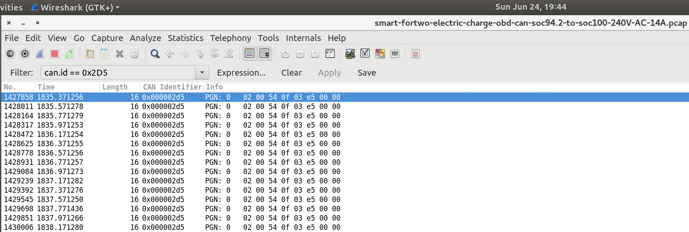

# Electric Smart fortwo car CAN bus dump

http://canable.io/ USB dongle used. Access to CAN bus obtained through OBD port (pins 6 and 14).
Host machine is Nvidia Jetson TX2 with Ubuntu 16.04 LTS Linux.

## Charging from 94.2% to 100%
CAN bus dump was created with command:
```
tshark  -i 2 -w smart-fortwo-electric-charge-obd-can-soc94.2-to-soc100-240V-AC-14A.pcap
```

Wireshark GUI can be used to examine this file.

In the same time charging current monitored using OpenEVSE (over http API): `charge_current-soc94.2-to-soc100-240V-AC-14A.txt`

charging voltage 240V AC, charging current limited to 14A.

## Useful information for CAN messages decoding
BMS, cooling, charging, etc info can be decoded using information from following C source file (from ED BMSdiag project):
[canDiag.cpp](https://github.com/MyLab-odyssey/ED_BMSdiag/blob/master/ED_BMSdiag/canDiag.cpp)

For example, battery charge level (SOC) can be obtained from CAN message ID 0x2D5.


using this values we can get SOC state:
```((0x03 & 0x03)*256 + 0xe5)/10 = 99.7%```

## Reading charing current limit

start candump:
```
candump can0,483:7FF,61A:7FF
```

in separate console send request:
```
cansend can0 61a#0322022AFFFFFFFF; sleep 0.1; cansend can0 61a#300814FFFFFFFFFF
```

you should see request (61A) and reply (483) on the CAN bus:
```
  can0  61A   [8]  03 22 02 2A FF FF FF FF
  can0  483   [8]  10 0C 62 02 2A 00 00 02
  can0  61A   [8]  30 08 14 FF FF FF FF FF
  can0  483   [8]  21 _08_ FF FF 00 00 00 02
```

Second byte in second reply (483) contains charging current limit 8Amps. I have marked it with underscores.
